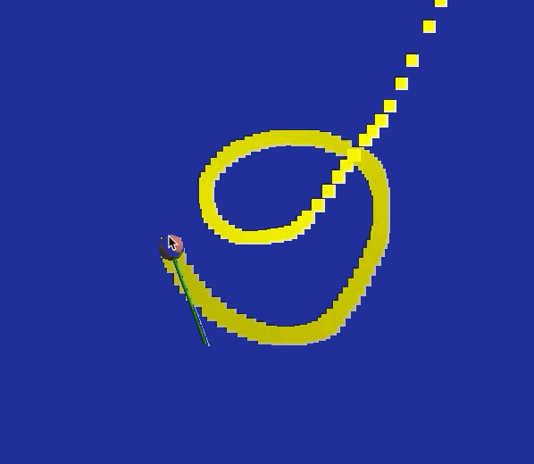
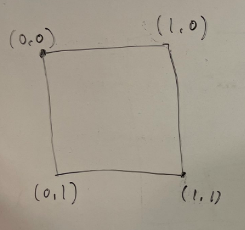
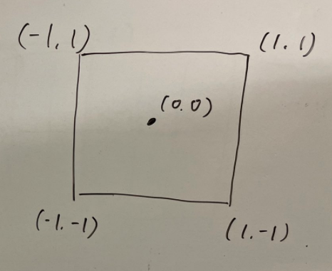

この資料は、従来版の後半第4回 - 軌跡を用いたインタラクション に対応します。
[このリポジトリ](https://github.com/trnciii/ciesample-trace)からファイルをダウンロードし、実行できるかを確認してください。
うまくいけばマウスカーソルに追従するステッキとその軌跡を描くことができます。

	

## 目次
* [準備](#準備)
	* [サンプルプログラムの解説](#サンプルプログラムの解説)
* [直方体で軌跡をつくる](#直方体で軌跡をつくる)
	* [寿命による管理](#寿命による管理)
	* [直方体の再利用](#直方体の再利用)
* [課題](#課題)

## 準備

ダウンロードしたプログラムは、ステッキがカーソルについて動くというものです。
これに軌跡を追加していきます。

まず、サンプルの内容を説明します。


### サンプルプログラムの解説

今回は平行投影での描画を用い、xy座標上での動きのみ考慮します。(`reshape`を確認)

ステッキの座標をグローバルに用意しておき、コールバック関数内で値の更新をしています。

```cpp
// 棒のx, y 座標
double stick_x = 0.0;
double stick_y = 0.0;

// ...

void MousePosFunc(GLFWwindow* window, double x, double y)
{
	// 画面サイズの取得
	int w, h;
	glfwGetFramebufferSize(window, &w, &h);
	
	stick_x =  ( x - w/2 ) / (w/2);//マウスを右に動かしたら、スティッキも右に
	stick_y = -( y - h/2 ) / (h/2);//マウスを下に動かしたら、スティッキも下に
}

```

座標の適切な変換が必要です。
カーソルの座標 `x, y` は左上を原点として[0, 1]の値をとります。
一方で我々がこれまで使ってきた座標は原点が中央で、画面端から端が[-1, 1]に正規化されています。

|ウィンドウの座標 ( x, y )|プログラム内の座標 ( stick_x, stick_y )|
|:-:|:-:|
|||

また、デフォルトの球と円柱を利用してカーソルの場所に描画しています。

```cpp
void display(int frame)
{
	// ...

	//オブジェクトを準備
	GLUquadricObj *sphere = gluNewQuadric();
	GLUquadricObj *cylinder = gluNewQuadric();

	// ステッキの描画
	glPushMatrix();
		glTranslated( stick_x, stick_y, 0.0 ); // 位置
		glMaterialfv(GL_FRONT_AND_BACK, GL_DIFFUSE, red);
		gluSphere(sphere, 0.05, 10, 10);
		glMaterialfv(GL_FRONT_AND_BACK, GL_DIFFUSE, green);
		glRotated(90.0, 1.0, 0.0, 0.4);
		gluCylinder(cylinder, 0.01, 0.01, 0.4, 10, 10);
	glPopMatrix();
}
```

## 直方体で軌跡をつくる

軌跡をたくさん(256個)の直方体を並べてつくります。
ただし、軌跡の長さがかわるので常に直方体の数が256であるとは限りません。
全体のうち何個かの直方体のみを描画できるようなプログラムが必要になります。

これは、各直方体を描画するかを記録する配列を用いて実装します。
`int cube_life[256]`　という配列がグローバルにあります。
マウスカーソルがうごくたびにこれに寿命をあらわす値をいれていき、寿命が残っている場合に描画するというプログラムに書き換えます。

### 寿命による管理

マウスカーソルが動くたびに呼ばれるコールバック関数のなかで、寿命が0であるの直方体をひとつ選び、`MAX_LIFE`の寿命を与えるようにします。
はじめて`cube_life[i] == 0`を満たしたとき`break`するので、寿命が与えられる直方体は`MousePosFunc`の実行につき一つです。

```cpp
void MousePosFunc(GLFWwindow* window, double x, double y)
{
	// ...

	for( int i=0; i < CUBE_NUM; i++ )
	{
		if( cube_life[i] == 0 )
		{
			cube_life[i] = MAX_LIFE;
			cube_x[i] = stick_x;
			cube_y[i] = stick_y;
			break;
		}
	}
}
```

寿命が残っている直方体のみを描画します。

```cpp
void display(int frame)
{
	// ...

	//オブジェクトを準備
	GLUquadricObj *sphere = gluNewQuadric();
	GLUquadricObj *cylinder = gluNewQuadric();

	// 軌跡の描画
	for( int i=0; i < CUBE_NUM; i++ )
	{
		if( cube_life[i] != 0 ) // 寿命が残っているもののみ
		{
			glPushMatrix();
				glMaterialfv( GL_FRONT_AND_BACK, GL_DIFFUSE, yellow );
				glTranslated( cube_x[i], cube_y[i], -0.9f );
				makebox( 0.075, 0.075, 0.00, GL_POLYGON );
			glPopMatrix();
		}
	}

	// ...
```

以上で軌跡が出るようになりましたが、ある程度の長さで切れてしまいます。
軌跡を描き続けるために、古いものから直方体を再利用するようにします。

### 直方体の再利用

それぞれの直方体の寿命をフレーム毎に減らしていきます。
寿命が0になったものは寿命が与えられる対象となり、再利用されます。

ついでに、寿命に応じて線を細くします。

```cpp
void display(int frame)
{
	// ...

	// 軌跡の描画
	for( int i=0; i < CUBE_NUM; i++ )
	{
		if( cube_life[i] != 0 )
		{
			cube_life[i]--; // 寿命をへらす
			double scale = cube_life[i]/MAX_LIFE; // 線の太さの割合

			glPushMatrix();
				glMaterialfv( GL_FRONT_AND_BACK, GL_DIFFUSE, yellow );
				glTranslated( cube_x[i], cube_y[i], -0.9f );
				glScalef(scale, scale, scale); // 線を細くする
				makebox( 0.075, 0.075, 0.00, GL_POLYGON );
			glPopMatrix();
		}
	}

	// ...
}
```

寿命を更新することで軌跡をずっと描けるようになりました。

## 課題

`cube_life`を使った処理を追加/変更し、軌跡に変化をつけてください。
色や太さを変える、軌跡の長さを変える、寿命の減りかたをかえてイージングを変えるなど。
