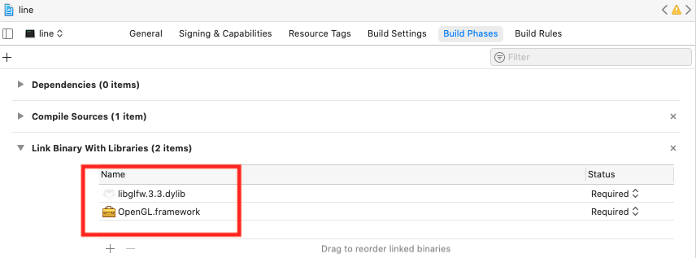
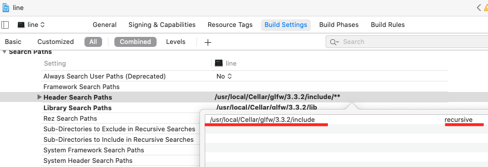
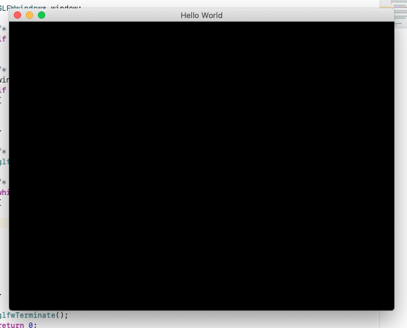

以下のサイトを参考にして、黒いウィンドウを出すとこまでやります。適宜参照してください。
[https://qiita.com/souring001/items/64881ff1383a15271b5b](https://qiita.com/souring001/items/64881ff1383a15271b5b)

完成したプロジェクトファイルも置いてるので、最悪zipでダウンロードして確認してみてください

# 各種インストール
## xcode
App store で探してインストールしてください  

## brew
homebrew を使って授業で使うライブラリをインストールします。<br>
まだ入れてない方は、ターミナルから下のコードでいれましょう。[https://brew.sh/](https://brew.sh/)
```commandline
/bin/bash -c "$(curl -fsSL https://raw.githubusercontent.com/Homebrew/install/master/install.sh)"
```

## GLFW
ターミナルで以下のコードをいれます
```commandline
brew install glfw
```
---

#プロジェクトの作成
まず xcode で新しいC++プロジェクトを作成します<br>
参考サイトをみたほうがはやいと思う

## ライブラリ追加
* Build phases -> Link Binary with Libraries から ``OpenGL.framework`` を選択
* 同じリストに ``/usr/local/Cellar/glfw/3.3/lib`` にある　``libglfw.3.3.dylib``　をドロップして追加


## ヘッダ追加
Build settings -> Header Search Path の項目に`/usr/local/Cellar/glfw/3.3.2/include`を追加.<br>リストの右側をrecursive に設定<br>


## コードを書いてウィンドウを出す  
main.cpp に以下のソースをコピペしてビルドします (左上の再生ボタン)<br>
[https://www.glfw.org/documentation.html](https://www.glfw.org/documentation.html)<br>

```cpp
#include <GLFW/glfw3.h>

int main(void)
{
    GLFWwindow* window;

    /* Initialize the library */
    if (!glfwInit())
        return -1;

    /* Create a windowed mode window and its OpenGL context */
    window = glfwCreateWindow(640, 480, "Hello World", NULL, NULL);
    if (!window)
    {
        glfwTerminate();
        return -1;
    }

    /* Make the window's context current */
    glfwMakeContextCurrent(window);

    /* Loop until the user closes the window */
    while (!glfwWindowShouldClose(window))
    {
        /* Render here */
        glClear(GL_COLOR_BUFFER_BIT);

        /* Swap front and back buffers */
        glfwSwapBuffers(window);

        /* Poll for and process events */
        glfwPollEvents();
    }

    glfwTerminate();
    return 0;
}
```
いろいろ警告が出るかもしれませんが、このような "Hello World" という真っ黒いウィンドウが出ればOKです。<br><br>


## 連絡先
なにかつまづいた場合はどこに質問すればいいんだろう
とりあえず実質mac 担当の土井は以下で連絡がつきます
doi.kohei.682@s.kyushu-u.ac.jp<br>
[@trnciii](twitter.com/trnciii)

moodle かslack か考えると思います。

# FAQ
??