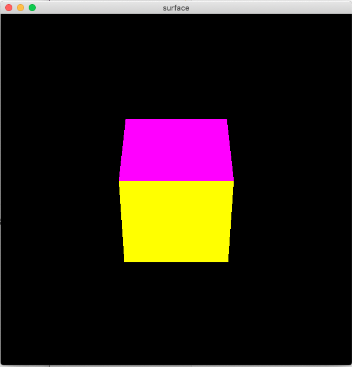
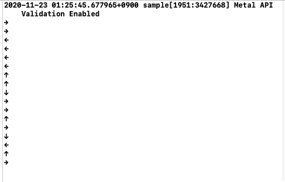
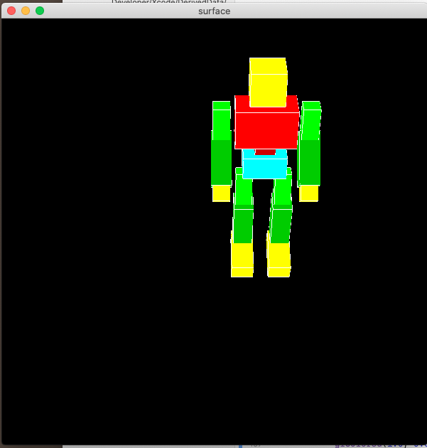
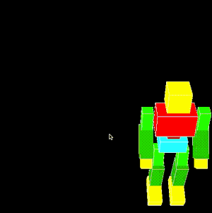
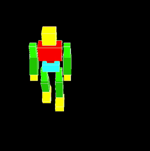
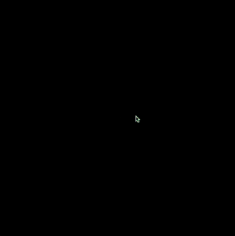

この資料は、従来版の後半第1回 - キーボードやマウスによる入力 に対応します。

## 目次
* [準備](#準備)
* [プログラムの解説](#プログラムの解説)
	* [キーボードに連動する関数](#キーボードに連動する関数)
	* [コールバック関数の登録](#コールバック関数の登録)
	* [他のコールバック関数](#他のコールバック関数)
* [方向キーで立方体を動かす](#方向キーで立方体を動かす)
	* [プログラムの書き換え](#プログラムの書き換え)
	* [課題1](#課題1)
* ["押しっぱなし"の取得](#"押しっぱなし"の取得)
	* [フラグによる制御](#フラグによる制御)
	* [課題2](#課題2)
* [方向キーでキャラクターを動かす](#方向キーでキャラクターを動かす)
	* [準備-ロボットの表示](*準備-ロボットの表示)
	* [進行方向の制御](*進行方向の制御)
	* [歩行アニメーションの追加](*歩行アニメーションの追加)
	* [課題3](*課題3)
	* [課題4](*課題4)


## 準備
ここのコードをダウンロード、解凍してください。sample.xcodeproj を開き実行すると立方体が表示されることを確認してください。
また、矢印キーを押すとコンソールに対応した文字が出力されることを確認してください。
コンソールはXcodeウィンドウの右下にあります。

|ウィンドウ|コンソール|
|:-:|:-:|
|  |  |

## プログラムの解説
今回からキーボードやマウスの動きなど、ユーザーによる入力を利用したプログラムを書きます。
そのために**コールバック関数**という仕組みを利用します。
これはGLFWのほうで検知した特定の動作に対して、登録した好きな関数を実行できるというものです。

実際にキーボードにあわせて矢印を出力する部分がどのように書かれているか見ていきます。

### キーボードに連動する関数
キーボードが押されたときに動作する関数として、`KeyFunc`を定義しました。
関数の引数は[仕様](https://www.glfw.org/docs/3.3/group__input.html#ga0192a232a41e4e82948217c8ba94fdfd)で決まっており、キーの種類や動作を表す変数として関数内で使うことができます。

```cpp
void KeyFunc(GLFWwindow* window, int key, int scancode, int action, int mods)
{
	// ↑
	if( key == GLFW_KEY_UP && action == GLFW_PRESS ){
		printf("↑\n");
	}
	
	// ↓
	if( key == GLFW_KEY_DOWN && action == GLFW_PRESS ){
		printf("↓\n");
	}
	
	// ←
	if( key == GLFW_KEY_LEFT && action == GLFW_PRESS ){
		printf("←\n");
	}
	
	// →
	if( key == GLFW_KEY_RIGHT && action == GLFW_PRESS ){
		printf("→\n");
	}
	
	// スペースキー
	if( key == GLFW_KEY_SPACE && action == GLFW_PRESS ){
		printf("SPACE\n");
	}
	
	// Aキー
	if( key == 'A' && action == GLFW_PRESS ){
		printf( "A\n" );
	}
}
```

この関数では、どのキーが押されたかによって処理を分岐し、文字を出力しています。

キーの種類は関数の第二引数`int key` に入っています。
文字の場合は文字コード、矢印など特殊なものはGLFWで用意された `GLFW_KEY_UP` などの値が入っています。

キーが押されたことを判定するために、分岐のときに第四引数`int action` の値も同時に確認します。
この変数には、押された瞬間に`GLFW_PRESS`、離された瞬間には`GLFW_RELEASE`がはいっています。

### コールバック関数の登録
プログラムの最初に、定義した関数`KeyFunc`をGLFWにわかるように登録します。
これは `main`関数内の `glfwSetKeyCallback(window, KeyFunc);` という部分で行っています。

### 他のコールバック関数
キーボードの検出のほかにも以下のコールバック関数を用意しています。
プログラムを読み、それぞれの引数と関数を登録している部分を確認してください。

|関数名	|内容	|引数(使うもの)	|
|:-		|:-		|:-				|
|KeyFunc            |キーボードの動作を検出		|キーや動作の種類		|
|MouseButtonFunc    |マウスボタンの動作を検出	|ボタンと動作の種類		|
|MousePosFunc       |マウスの移動を検出     	|座標(x, y)			|
|MouseWheelFunc     |ホイールの動作を検出		|ホイールの移動(x, y)	|


## 方向キーで立方体を動かす
入力された方向キーで立方体を移動させます。↑キーで上、↓キーで下に動くようにします。

### プログラムの書き換え

まず、位置を格納する大域変数を用意します。

```cpp
#include "GLFW/glfw3.h"
#include <math.h>
#include "box.hpp"
#include <stdio.h>
#include <stdio.h>

double pos_z = 0; // 追加

// 登場する関数(いつもの)
void myinit(GLFWwindow** window);
```
次に`KeyFunc`の中でキーボードの入力によって`pos_z`を更新します。
```cpp
void KeyFunc(GLFWwindow* window, int key, int scancode, int action, int mods)
{
    // ↑
    if( key == GLFW_KEY_UP && action == GLFW_PRESS ){
        printf("↑\n");
        pos_z -= 0.5; // 追加
    }
    
    // ↓
    if( key == GLFW_KEY_DOWN && action == GLFW_PRESS ){
        printf("↓\n");
        pos_z += 0.5; // 追加
    }
// ...
```

最後`display`のほうで立方体を`pos_z`だけ移動させます。

```cpp
void display(int frame)
{
    glClear(GL_COLOR_BUFFER_BIT | GL_DEPTH_BUFFER_BIT);

    glMatrixMode(GL_MODELVIEW);
    glLoadIdentity();

    glTranslated( 0.0, 0.0, pos_z );
    makebox(1.0, 1.0, 1.0, GL_POLYGON);
}
```
これで実行すると、矢印キーの上下に応じて立方体が移動します。

### 課題1
矢印キーの左右に応じて立方体が移動するようにしてください。
後から使うので、左右の移動を保持する変数名は`pos_x` とすることを推奨します。


## "押しっぱなし"の取得
今までの流れで、矢印キーを押す事で立方体が動くようになりました。
ただ、動かし続けるためにはキーボードを連打する必要があります。
ここでは、「押しっぱなし」の取得をしたいと思います。

### フラグによる制御
`KeyFunc`ではキーが押された/離された瞬間のみを検知することができますが、その後キーが押されたままであるかはわかりません。
そのため、キーが押されているか否かの変数を用意して、これをもとに移動をおこないます。

以下のように変数の用意と移動の書き換えをおこないます。
ここで使う`bool` は真偽値を扱う型で、値として`true` または `false` をとります。

```cpp
double pos_x = 0.0;
double pos_z = 0.0;

// 大域変数として以下の各方向のフラグを定義
bool up	= false;
bool down	= false;
bool left	= false;
bool right	= false;

// 中略

//--描画内容--------------------------------------------------------------------
void display(int frame)
{
    glClear(GL_COLOR_BUFFER_BIT | GL_DEPTH_BUFFER_BIT);

    glMatrixMode(GL_MODELVIEW);
    glLoadIdentity();
    
    // フラグがtrueのときに各方向に移動する
    if( up ){
        pos_z -= 0.1;
    }
    if( down ){
        pos_z += 0.1;
    }
    if( left ){
        pos_x -= 0.1;
    }
    if( right ){
        pos_x += 0.1;
    }

    glTranslated( pos_x, 0.0, pos_z );
    makebox(1.0, 1.0, 1.0, GL_POLYGON);
}
```

最後に、`KeyFunc`の中で各方向のフラグを更新します。

### 課題2
`KeyFunc`を書き換えて、矢印キーとフラグ変数`up, down, left, right`が連動するようにしてください。
キーを押した瞬間に`true`, キーを離した瞬間に`false`を代入すればいいです。

## 方向キーでキャラクターを動かす

###	準備-ロボットの表示
キャラクターを動かすことで、さまざまな制御に慣れましょう。
かなり長いですが、立方体の描画を以下のロボットで置き換えます。

```cpp
glPushMatrix();
    /* 腰 */
    glScalef(0.3, 0.3, 0.3);
    glTranslated( pos_x, 0.0, pos_z ); //全体の移動
    // glRotated( dir, 0.0, 1.0, 0.0 );//全体の回転

    glColor3d(0.0, 1.0, 1.0);
    makeboxROBOT( 1.3, 0.7, 1.0, GL_POLYGON );//腰パーツ

    /* 胴体 */
    glPushMatrix();
        glTranslated(0.0, 0.4, 0.0);
        glRotated( 0.0, 0.0, 0.0, 0.0 );//胴体の回転*****
        glTranslated(0.0, 0.3, 0.0);
        glColor3d(0.8, 0.0, 0.0);
        makeboxROBOT( 0.6, 1.0, 0.6, GL_POLYGON );//腹パーツ

        glTranslated(0.0, 0.6, 0.0);
        glColor3d(1.0, 0.0, 0.0);
        makeboxROBOT( 1.8, 1.2, 1.0, GL_POLYGON );//胸パーツ
            
        glTranslated(0.0, 0.3, 0.0);

        /* 左手 */
        glPushMatrix();
            glTranslated(1.3, 0.0, 0.0);

            glRotated( 0.0, 0.0, 0.0, 0.0 );//左上腕の回転*****
            
            glTranslated(0.0, -0.5, 0.0);
            glColor3d(0.0, 1.0, 0.0);
            makeboxROBOT( 0.5, 1.5, 0.5, GL_POLYGON );//上腕パーツ

            glTranslated(0.0, -0.5, 0.0);
            glPushMatrix();
                glTranslated(0.0, 0.0, 0.0);
                glRotated(-40.0, 1.0, 0.0, 0.0);
                
                glRotated( 0.0, 0.0, 0.0, 0.0 );//左腕の回転*****
                
                glTranslated(0.0, -0.5, 0.0);
                glColor3d(0.0, 0.8, 0.0);
                makeboxROBOT( 0.6, 1.6, 0.7, GL_POLYGON );//腕パーツ

                glTranslated(0.0, -0.9, 0.0);
                glColor3d(1.0, 1.0, 0.0);
                makeboxROBOT( 0.5, 0.7, 0.5, GL_POLYGON );//手パーツ
            glPopMatrix();
        glPopMatrix();

        /* 右手 */
        glPushMatrix();
            glTranslated(-1.3, 0.0, 0.0);

            glRotated( 0.0, 0.0, 0.0, 0.0 );//右上腕の回転*****
            
            glTranslated(0.0, -0.5, 0.0);
            glColor3d(0.0, 1.0, 0.0);
            makeboxROBOT( 0.5, 1.5, 0.5, GL_POLYGON );//上腕パーツ

            glTranslated(0.0, -0.5, 0.0);
            glPushMatrix();
                glTranslated(0.0, 0.0, 0.0);
                glRotated(-40.0, 1.0, 0.0, 0.0);
                
                glRotated( 0.0, 0.0, 0.0, 0.0 );//右腕の回転*****
                
                glTranslated(0.0, -0.5, 0.0);
                glColor3d(0.0, 0.8, 0.0);
                makeboxROBOT( 0.6, 1.6, 0.7, GL_POLYGON );//腕パーツ

                glTranslated(0.0, -0.9, 0.0);
                glColor3d(1.0, 1.0, 0.0);
                makeboxROBOT( 0.5, 0.7, 0.5, GL_POLYGON );//手パーツ
            glPopMatrix();
        glPopMatrix();

        /* 頭 */
        glPushMatrix();
            glTranslated(0.0, 0.4, 0.0);
            glRotated( 0.0, 0.0, 0.0, 0.0 );//頭の回転*****
            glColor3d(0.8, 0.8, 0.0);
            makeboxROBOT( 0.4, 1.2, 0.4, GL_POLYGON );//首パーツ

            glTranslated(0.0, 0.6, 0.0);
            glColor3d(1.0, 1.0, 0.0);
            makeboxROBOT( 1.0, 1.0, 1.0, GL_POLYGON );//頭パーツ
        glPopMatrix();
    glPopMatrix();

    /* 右足 */
    glPushMatrix();
        glTranslated(-0.6, -0.7, 0.0);
        glRotated(-10.0, 1.0, 0.0, 0.0);
        glRotated( 0.0, 0.0, 0.0, 0.0 );//右腿の回転*****
        
        glTranslated(0.0, -0.5, 0.0);
        glColor3d(0.0, 1.0, 0.0);
        makeboxROBOT( 0.5, 1.5, 0.5, GL_POLYGON );//腿パーツ

        glTranslated(0.0, -0.5, 0.0);

        glPushMatrix();
            glTranslated(0.0, 0.0, 0.0);
            glRotated(20.0, 1.0, 0.0, 0.0);
            
            glRotated( 0.0, 0.0, 0.0, 0.0 );//右脛の回転*****
            
            glTranslated(0.0, -0.5, 0.0);
            glColor3d(0.0, 0.8, 0.0);
            makeboxROBOT( 0.6, 1.6, 0.7, GL_POLYGON );//脛パーツ

            glTranslated(0.0, -1.4, 0.3);
            glColor3d(1.0, 1.0, 0.0);
            glRotated(10.0, 1.0, 0.0, 0.0);
            makeboxROBOT( 0.7, 0.6, 1.4, GL_POLYGON );//足パーツ
        glPopMatrix();
    glPopMatrix();
                
    /* 左足 */
    glPushMatrix();
        glTranslated(0.6, -0.7, 0.0);
        glRotated(-10.0, 1.0, 0.0, 0.0);

        glRotated( 0.0, 0.0, 0.0, 0.0 );//左腿の回転*****
        
        glTranslated(0.0, -0.5, 0.0);
        glColor3d(0.0, 1.0, 0.0);
        makeboxROBOT( 0.5, 1.5, 0.5, GL_POLYGON );//腿パーツ

        glTranslated(0.0, -0.5, 0.0);

        glPushMatrix();
            glTranslated(0.0, 0.0, 0.0);
            glRotated(20.0, 1.0, 0.0, 0.0);
            
            glRotated( 0.0, 0.0, 0.0, 0.0 );//左脛の回転*****
            
            glTranslated(0.0, -0.5, 0.0);
            glColor3d(0.0, 0.8, 0.0);
            makeboxROBOT( 0.6, 1.6, 0.7, GL_POLYGON );//脛パーツ

            glTranslated(0.0, -1.4, 0.3);
            glColor3d(1.0, 1.0, 0.0);
            glRotated(10.0, 1.0, 0.0, 0.0);
            makeboxROBOT( 0.7, 0.6, 1.4, GL_POLYGON );//足パーツ

        glPopMatrix();
    glPopMatrix();
glPopMatrix();
```

ロボットが表示され、`pos_x, pos_z`によって全体の移動ができることを確認してください。



### 進行方向の制御
立方体のときには気になりませんでしたが、キャラクターが移動するときには進行方向を向いてもらう方が自然に感じられますので、キーで入力した方向に応じてロボットを回転させます。

やることは移動と同じです。大域変数に方向を入れる変数`float dir` を用意し、キーのフラグを利用して値を決めます。
回転は、ロボットの上のほうにある腰パーツでおこないます。`//全体の回転`となっている部分をコメントアウトして利用してください。

```cpp
// 大域変数
float pos_x = 0;
float pos_z = 0;

bool up = false;
bool down = false;
bool left = false;
bool right = false;

float dir = 0; // 追加

// 中略

void display(int frame)
{
    glClear(GL_COLOR_BUFFER_BIT | GL_DEPTH_BUFFER_BIT);

    glMatrixMode(GL_MODELVIEW);
    glLoadIdentity();
    
    if(up){
    	pos_z -= 0.1;
    	dir = 180;
    }
    
    if(down){
    	pos_z += 0.1;
    	dir = 0;
    }

    if(left){
    	pos_x -= 0.1;
    	dir = -90;
    }

    if(right){
    	pos_x += 0.1;
    	dir = 90;
    }
    
   	// ロボットの描画
```

これでロボットの向きを変えることができました。



### 歩行アニメーションの追加
さらに、移動しているときには歩いているようなアニメーションを加えてみましょう。
とりあえず脚だけ振らせてみます。
歩行の一周期を0\~360度として回転し続ける変数`phase` を用意し、いずれかの方向キーが押されているときに値を更新します。

また、股関節や膝の回転を更新します。

```cpp
// 大域変数
float pos_x = 0;
float pos_z = 0;

bool up = false;
bool down = false;
bool left = false;
bool right = false;

float dir = 0;
float phase = 0; // 追加

// 中略

// 各変数の更新
    if(up){
        pos_z -= 0.1;
        dir = 180;
    }
    
    if(down){
        pos_z += 0.1;
        dir = 0;
    }

    if(left){
        pos_x -= 0.1;
        dir = -90;
    }

    if(right){
        pos_x += 0.1;
        dir = 90;
    }
    
    // 何らかのキーが押されているとき
    if(up || down || left || right){
        // phase が0~360度をまわる
        phase++;
        if(phase>360)phase = 0;
    }

    // ロボットの描画
```

また、ロボットの脚にある以下の部分のパラメータを埋め、回転させます。(コメントを参考に探してください)

* `glRotated( 10*sin(phase*0.2), 1.0, 0.0, 0.0 );//右腿の回転*****`
* `glRotated( 10*sin(phase*0.2), 0.0, 0.0, 0.0 );//右脛の回転*****`
* `glRotated(-10*sin(phase*0.2), 1.0, 0.0, 0.0 );//左腿の回転*****`
* `glRotated(-10*sin(phase*0.2), 1.0, 0.0, 0.0 );//左脛の回転*****`

完成するとこのようになります。



### 課題3
以下の問題点を解決するよう移動の制御を改善してください。

**問題点** 現在、二つのキーを同時に押すと斜めに移動するころができるが、ロボットの向きは四方向のいずれかとなってしまうので、複数のキーを押してもロボットが進行方向を向くようにしたい。

### 課題4
立方体または適当なキャラクターをひとつ、マウスカーソルを追いかけるように動かしてください。



マウスカーソルの位置は`MousePosFunc`の引数である`x, y`から取り出して利用します。
斜めからの視点では、カーソルの位置とロボットの移動する平面の対応を厳密に考えるのは難しいので、そのあたりは適当でいいです。

---

課題のほかにも、アニメーションや移動方法を変更してみてください。
また、作品をslack のほうに共有してくれると嬉しいです。


