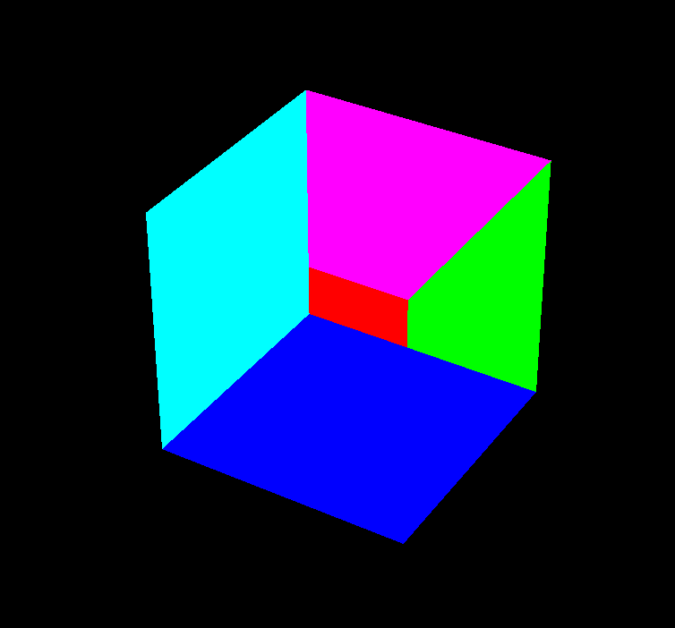
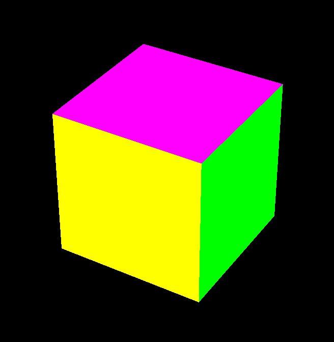
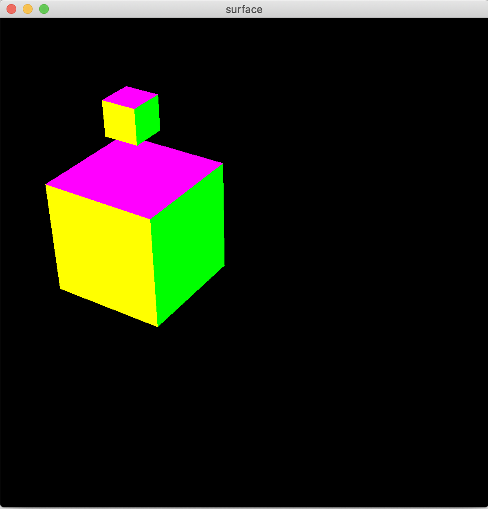
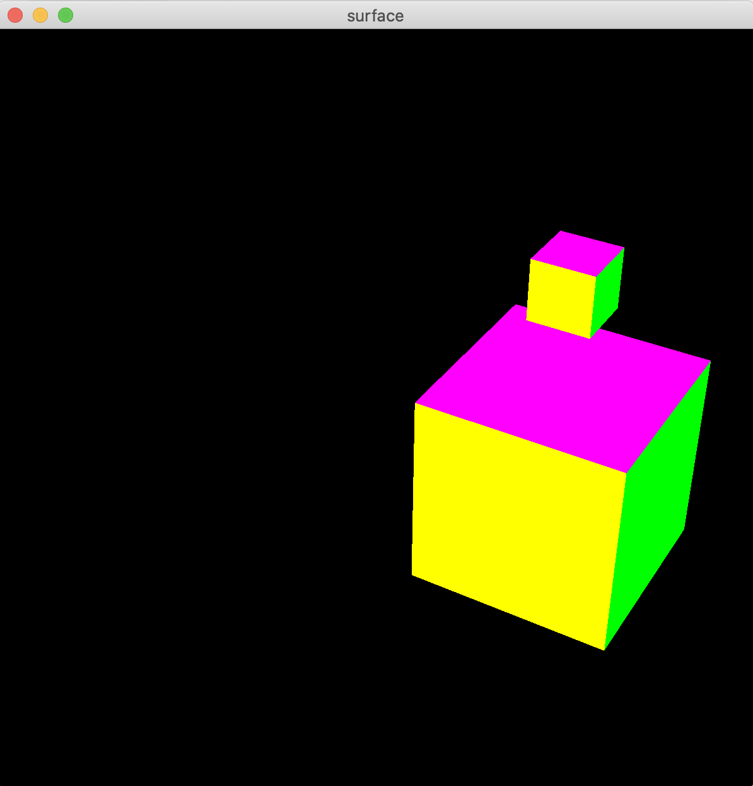
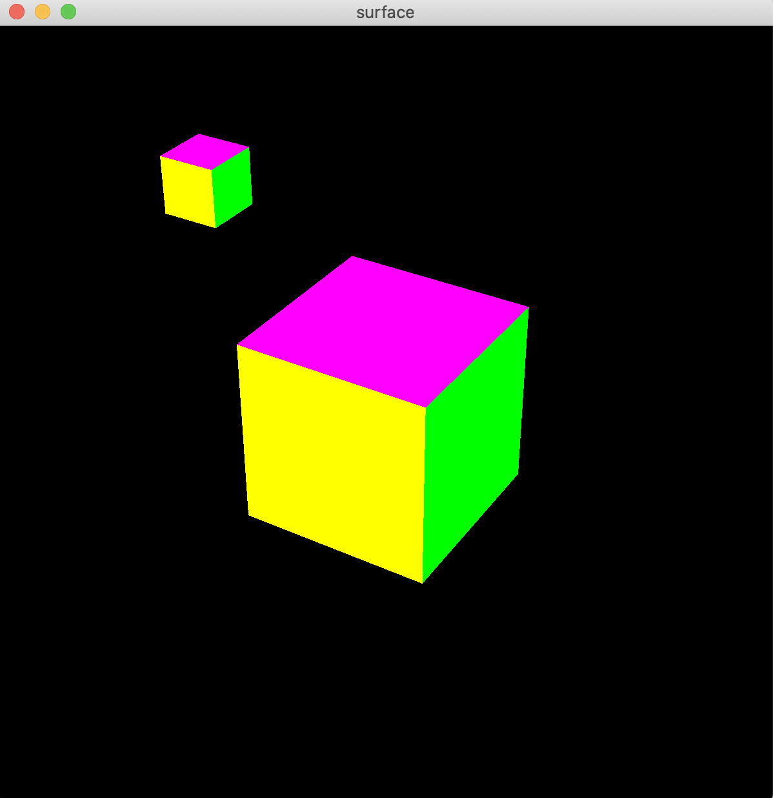

この資料は、従来版の第３回 - 3D 階層構造 に対応します。

## 目次
* [準備](#準備)<br>
* [プログラムの概要](#プログラムの概要)<br>
    * [立方体の描画](#立方体の描画)
    * [透視投影の設定](#透視投影の設定)
* [陰面消去](#陰面消去)
* [課題1](#課題1)
* [階層構造](#階層構造)
    * [階層構造とは](#階層構造とは)
    * [階層構造のつくりかた](#階層構造のつくりかた)
* [課題2](#課題2)


## 準備
ここのコードをダウンロード、解凍してください。sample.xcodeproj を開き実行すると立方体が表示されることを確認してください。

*macでよくあるのですが、実質的な画面の解像度がソフトウェア上の表示と異なっているために表示領域がおかしくなることがあります。その場合はウィンドウを移動させたり拡大/縮小すると正しい表示になります。*


## プログラムの概要
このプログラムでは、これまでの平行投影法と違い **透視投影法** によって立方体を描画しています。
main.cpp の中にある関数`display()`の中で` makebox(1.0, 1.0, 1.0);`という関数が使用されており、これで以下の図のように幅, 高さ, 奥行がそれぞれ1である立方体を描画します。<br>


### 立方体の描画
立方体を作る関数` makebox`は、box.hpp, box.cpp という2つのファイルの中に定義されています。<br>
<br>
box.hpp の中を確認してみると、makebox の定義は　`makebox(width, height, length, type);` となっており、引数は順に ** *x方向の大きさ, y方向の大きさ, z方向の大きさ, 描画タイプ* ** を指定します。

### 透視投影の設定
透視投影の設定は main.cpp の `reshape` 内で行っています。
```cpp
void reshape(GLFWwindow* window, int w, int h)
{
    glViewport( 0, 0, (GLsizei)w, (GLsizei)h ); //ウィンドウ全体をビューポートにする
    glMatrixMode( GL_PROJECTION );
    glLoadIdentity(); //変換行列の初期化 
   
    gluPerspective(30.0, (double)w / (double)h, 1.0, 100.0);
    gluLookAt(
        3.0, 4.0, 5.0,    //どこから見てるか
        0.0, 0.0, 0.0,    //どこを見てるか
        0.0, 1.0, 0.0    //どの向きが上向きか
    );
}
```
gluPerspective();では透視投影法の視体積を設定しています。
括弧左から、視野角、縦横比、手前の座標、奥の座標を設定し、この範囲内にある物体を表示します。

`gluPerspactive(th, w/h, near, far)`のとき次の図のようになります<br>


関数`gluLookAt`は視点の設定をしています。
最初の３つのパラメータは視点の位置です。次の３つのパラメータは注視点の位置を表しています。このサンプルでは、カメラは位置(3.0, 4.0, 5.0)から原点(0.0, 0.0, 0.0) のほうを向いています。

最後の３つのパラメータで、どちらが「上」かということを決めており、この場合y軸が上になります。これによってカメラの傾きを決めています。

## 陰面消去

物体の裏側が見えないことや、物体の一部がその他の物体にさえぎられて見えないような状況は実世界では当然のことです。しかし、CGではこれらをちゃんと設定しない限り、いわゆる”正しい”表示にはなりません。
この「本来見えない面を消す」ことを、隠面消去といいます。

このことを確認してみましょう。main.cpp の`display`関数を以下のように書き換えて、ポリゴンで立方体を表示するように切り替えましょう。
```cpp
void display(void)
{
    glClear(GL_COLOR_BUFFER_BIT);

    glMatrixMode(GL_MODELVIEW);
    glLoadIdentity();

    // makebox(1.0,1.0,1.0);
    ↓　ポリゴン表示に書き換え
    makebox(1.0, 1.0, 1.0, GL_POLYGON);
}
```
このプログラムを実行すると面の前後関係が正しく表示されない、以下のような状態になります。<br>
<bt>

陰面消去をおこなうには、プログラムを以下のように書き換えます。
```cpp
void display(void)
{
    // glClear(GL_COLOR_BUFFER_BIT);
    　↓ 
    glClear(GL_COLOR_BUFFER_BIT | GL_DEPTH_BUFFER_BIT);

    glMatrixMode(GL_MODELVIEW);
    glLoadIdentity();

    glEnable(GL_DEPTH_TEST); // 追加
    
    makebox(1.0,1.0,1.0,GL_POLYGON);
}
```
これで奥行を処理するデプスバッファを利用した描画を行うという指示ができました。正しく立方体を表示できたと思います。<br>
<br>
デプスバッファというのはそれぞれの画素ごとにポリゴンまでの距離(奥行, 深度)を記録しておくもので、この情報を利用して一番手前にあるポリゴンを表示することができます。

`glEnable(GL_DEPTH_TEST)` で奥行のチェックして画素を書き換えるという設定をしています。また、描画の最初にデプスバッファを初期化するため、`glClear`関数に GL_DEPTH_BUFFER_BIT を与えています。

## 課題1
前回までのプログラムを参考に、箱を増殖させて次のようなものを作ってみてください。<br>


## 階層構造
ボックスが綺麗に表示できるようになったところで、すこし複雑な表現をおこなってみましょう。このように複数のボックスがあるとします。<br>
<br>

<!-- ### 課題2
下図のようにオブジェクトを配置してください。色や形は自由に変えていいです。<br>
<br> -->

### 階層構造とは
ここで、Bのオブジェクトを動かすとAやCが一緒に動くようにするにはどうしたらいいでしょうか。

このような処理は、ひとまとまりのオブジェクトを一度に動かしたり（例：木を作ったとき、幹を移動させると、枝、葉が一緒に移動する→下図）、関節のある物体を作るとき（例：肩を回すと腕・肘・二の腕・指が一緒に回る）に必要になってきます。

|   幹を動かせば木全体が動く(理想)    |   幹を動かしても葉や枝が残ってしまう場合 |
|:------------------------------:|:-------------------------------:|
|||

これは、階層構造をつくる＝オブジェクトの間に親子関係をつくることで実現できます。<br>


例えば、AがBの親のとき、Aが動くとBもAとの位置関係を保ったままついてきます。<br>


Aがその場で回転するとどうなるでしょう？BはAの周りをぐるぐると回ることになります。<br>


一方Bがどんなに動いても、Aがついてきたりはしません。Bが拡大・縮小しても、その場で回転しても、Aには全く影響がありません。しかしやっぱり、散々Bが動いてAとの距離が相当に離れてしまっても、Aが移動するとその位置関係を保ったままBはついてきます。


### 階層構造のつくりかた
OpenGLで階層構造を作るには、`glPopMatrix()`関数と`glPushMatrix()`関数を使います。 例として、`display()`で箱を出す部分を以下のように書き換えます。
```cpp
glPushMatrix(); // 階層1
    glTranslated(0, 0, 0); // ★ 親に適用される
    makebox(1,1,1, GL_POLYGON); // A
    
    glPushMatrix(); // 階層2
        glTranslated(0, 1, 0); // ◆ 子の階層のみに適用される
        makebox(0.3,0.3,0.3, GL_POLYGON); // B
    glPopMatrix(); // 階層を戻る
    
glPopMatrix(); // 階層を戻る
```
最初の`glPushMatrix();`がひとつめの階層です。ここでボックスをひとつ描きます。このボックスをAとします。
そして、次の`glPushMatrix();`で階層を下りて、ボックスをひとつ描きます。このボックスをBとします。
次の行の`glPopMatrix();`は階層を戻るときに使います。これでボックスAを描いた階層と同じところに戻ります。
更に、もう一度`glPopMatrix();`をして、ひとつめの階層から脱出します。
ボックスAよりもボックスBのほうが下の階層にありますので、AはBの親（BはAの子）になります。

なお、インデントは階層をわかりやすくするためにつけています。

★の`glTranslated(0,0,0)`を引数を適当に変えてボックスを移動させてみましょう。ボックスBがボックスAに追従して移動します。<br>



一方で◆の`glTranslated(0,0,0)`を変更してみると、ボックスBだけを移動させることができます。<br>


回転や拡大/縮小などの操作に関しても同様のはたらきがあります。

### 課題2
階層構造を使ってロボットを作って下さい。単純なものでもいいですし、人型のような複雑なものに挑戦してもいいです。胴体を動かすと脚や腕がついてくるといった操作が可能なものをつくり、さまざまな姿勢をとらせてください。<br>


できた画像をキャプチャして、slackのほうに共有してくれると嬉しいです。

<details>
    <summary>難しいという方へ...</summary>
    解答例をおいておきます。変形を行う関数`glTranslated`, `glRotated`などをいじってみて、階層構造のはたらきを理解しましょう。

```cpp
glPushMatrix();  //-- 胴
    glTranslated(0, -1.2, 0);
    makebox(1, 1, 1, GL_POLYGON);

    glPushMatrix();   // ----　頭
        glTranslated(0.0, 1.0, 0.0);
        makebox(1.0, 1.0, 1.0, GL_POLYGON);

        glPushMatrix(); // --- 左目
            glTranslated(0.25, 0.1, 0);
            glRotated(10, 0, 0, 1);
            glRotated(180, 0, 1, 0);
            makebox(0.3, 0.05, 1.2, GL_POLYGON);
        glPopMatrix();

        glPushMatrix(); // --- 左目
            glTranslated(-0.25, 0.1, 0);
            glRotated(-10, 0, 0, 1);
            glRotated(180, 0, 1, 0);
            makebox(0.3, 0.05, 1.2, GL_POLYGON);
        glPopMatrix();

        glPushMatrix(); // --- 口
            glTranslated(0, -0.2, 0);
            glRotated( 180, 0, 1, 0);
            makebox(0.7, 0.05, 1.2, GL_POLYGON);
        glPopMatrix();
    glPopMatrix(); // 頭おわり


    glPushMatrix();  //-- 右足
        glTranslated(-0.35, -1.2, 0);
        makebox(0.3, 1, 1, GL_POLYGON);
    glPopMatrix();


    glPushMatrix();  //-- 左足
        glTranslated( 0.35, -1.2, 0);
        makebox(0.3, 1, 1, GL_POLYGON);
    glPopMatrix();


    glPushMatrix();  //-- 右腕
        glTranslated(-1.2, 0.35, 0);
        makebox(1, 0.3, 1, GL_POLYGON);
    glPopMatrix();


    glPushMatrix();  //-- 左腕
        glTranslated( 1.2, 0.35, 0);
        makebox(1, 0.3, 1, GL_POLYGON);
    glPopMatrix();

glPopMatrix();

```
</details>
